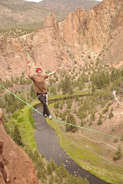
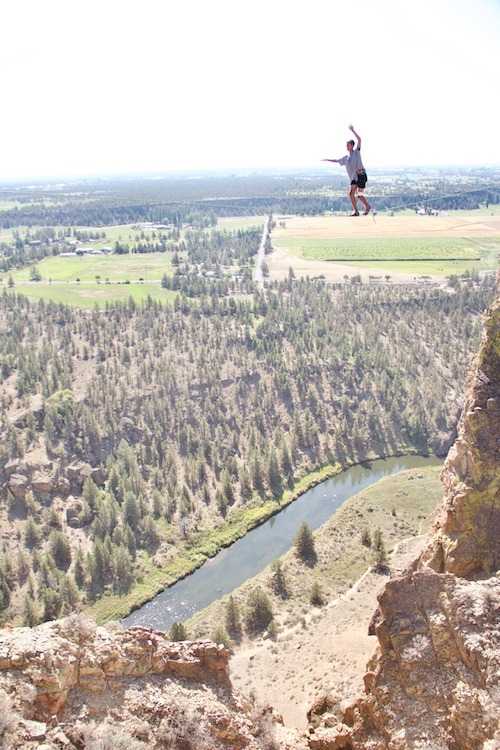
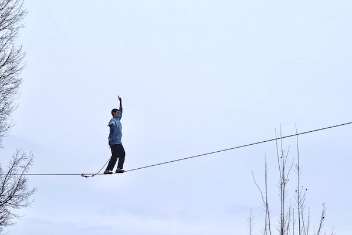

# Optimization Engineer

Howard specializes in the creation and application of optimization algorithms for big data problems, including for deep learning applications. He also enjoys creating mathematical graphics for communicating in research and education.

[Typal Academy Course :octicons-heart-fill-24:{ .heart }](https://typal.academy){ .md-button .md-button--primary }

A friendly introduction to real analysis

 

[Typal Academy Research :fontawesome-solid-face-smile:](https://research.typal.academy){ .md-button .md-button--primary }

[Google Scholar Profile :fontawesome-brands-google:](https://scholar.google.com/citations?user=blvaFx4AAAAJ){ .md-button .md-button--primary}

Research at the intersection of big data, optimization, and explainability

 

[Basic Notes :fontawesome-solid-file-lines: ](assets/basic-notes.pdf){ .md-button .md-button--primary }

[Numerical Analyis Notes :fontawesome-solid-file-lines: ](assets/num-anal-notes.pdf){ .md-button .md-button--primary }

[Applied Differential Equations Notes :fontawesome-solid-file-lines: ](assets/ade-notes.pdf){ .md-button .md-button--primary } 

Notes for qualifying exams in the math PhD program at UCLA

 

[Contact Form :material-chat-processing: ](https://form.jotform.com/heatonforms/contact){ .md-button .md-button--primary }

 

Howard enjoys surfing, running, and slacklining. Below are photos of him slacklining.

<figure markdown>
  { width="300" }
  <figcaption>Slacklining at Smith Rock, OR.</figcaption>
</figure>

<figure markdown>
  { width="300" }
  <figcaption>Slacklining at Smith Rock, OR.</figcaption>
</figure>

<figure markdown>
  { width="300" }
  <figcaption>Slacklining at a park in College Place, WA.</figcaption>
</figure>
